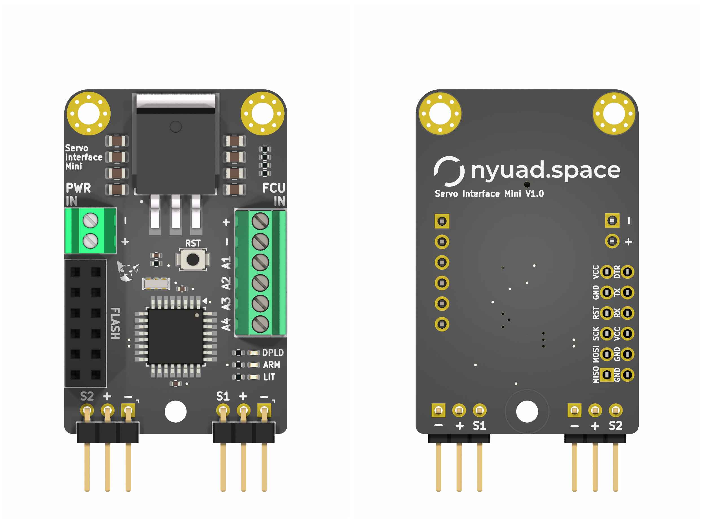

# Servo Interface Mini

## Overview

The **Servo Interface Mini** is a compact, flight-proven board built around the ATmega328P. It controls two servos via PWM based on logic changes on pyro channels. The board is part of our custom rocket parachute deployment system called the **Hold-Down Release Mechanism (HDRM)**.

It translates changes on pyro outputs from a flight computer into servo movement that actuates deployment hardware.

## Features

* **Microcontroller**: ATmega328P running Arduino-compatible firmware
* **Dual PWM Outputs**: Drives two standard hobby servos
* **Pyro Channel Triggering**: Responds to logic transitions on pyro lines
* **Status Indicators**: Onboard LEDs for deployment and system debugging
* **Power Supply**: Integrated LDO regulator supplies up to **5A at 5V** to servos and logic
* **Programming**: FTDI header for serial programming
* **Form Factor**: Compact layout with mounting holes for rugged, enclosed deployment

## Applications

* Servo-based parachute deployment systems
* Signal translation between flight computers and actuators
* Compact automation setups in rocketry and UAV systems

## Programming

The board is Arduino-compatible and programmed over an FTDI serial connection.

1. **Board Selection**: Choose **Arduino Pro Mini (5V, 16 MHz)** in the Arduino IDE
2. **Upload Method**: Use an FTDI-to-USB adapter connected to the 6-pin header
3. **Bootloader**: Compatible with standard Arduino bootloaders for ATmega328P

## Future Improvements

* Switch to **ATmega32U4** for native USB support and remove the need for an FTDI adapter

## Notes

* Pyro channel inputs are pulled up to 5V
* Designed for flight computers that ground pyro outputs (open-drain or active-low)
* Make sure servo current does not exceed 5A limit of onboard regulator
* Double check servo travel range to avoid overdriving linkages

**Disclaimer**: Use the files, hardware, and software in this repository at your own risk. We accept no responsibility for damage, failure, or unexpected behavior, especially during live flight tests.
